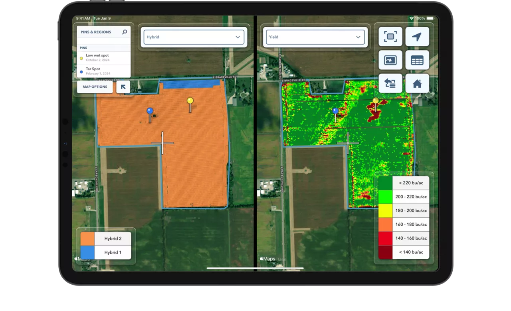
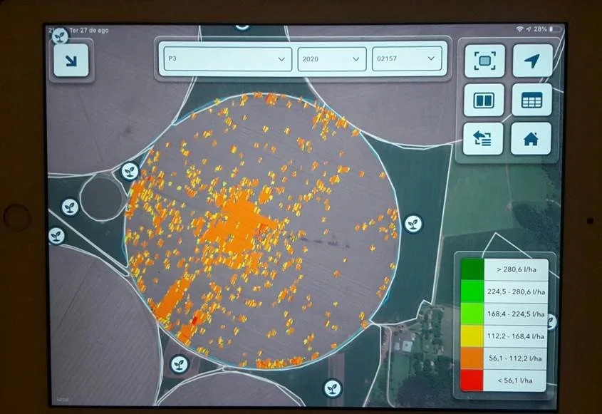
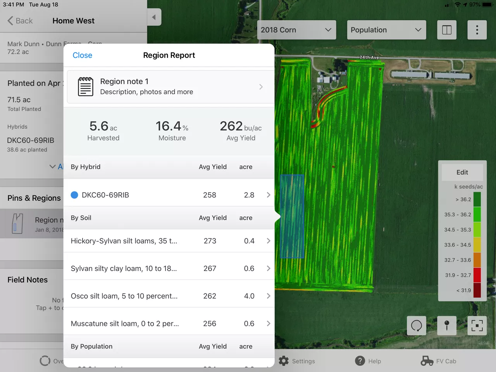
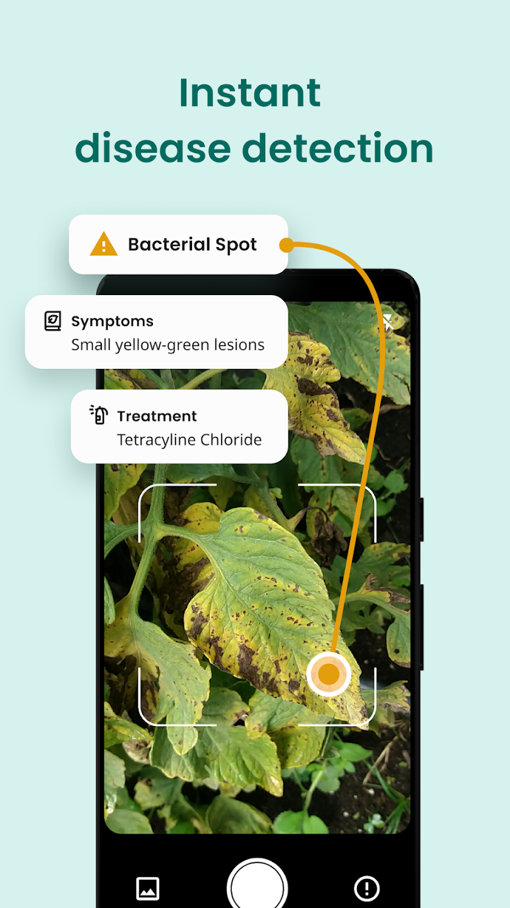
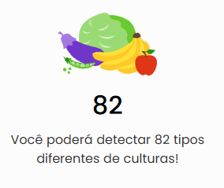
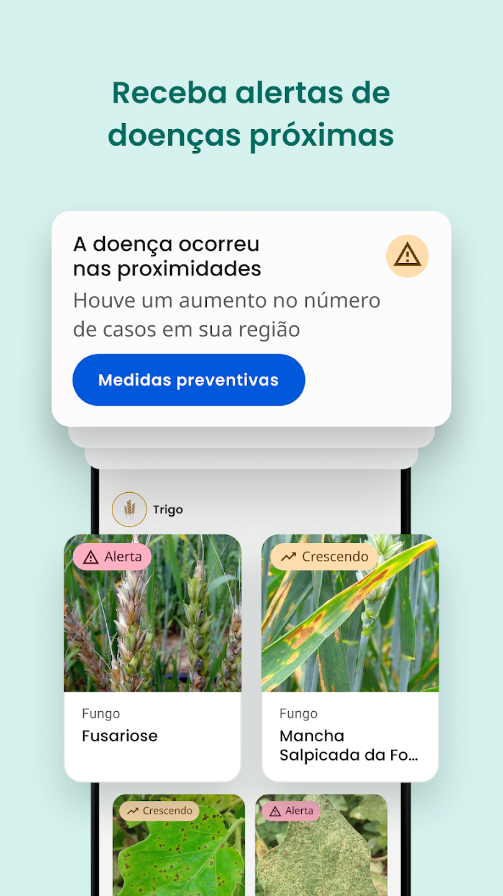
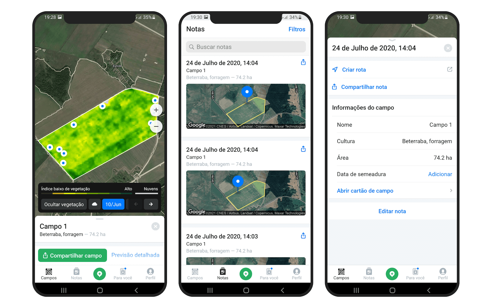
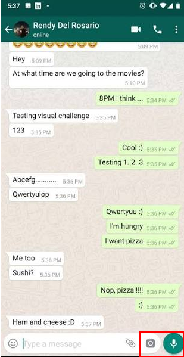
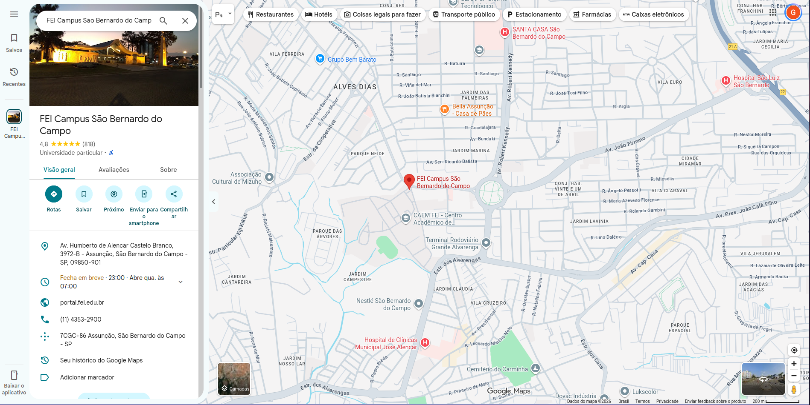
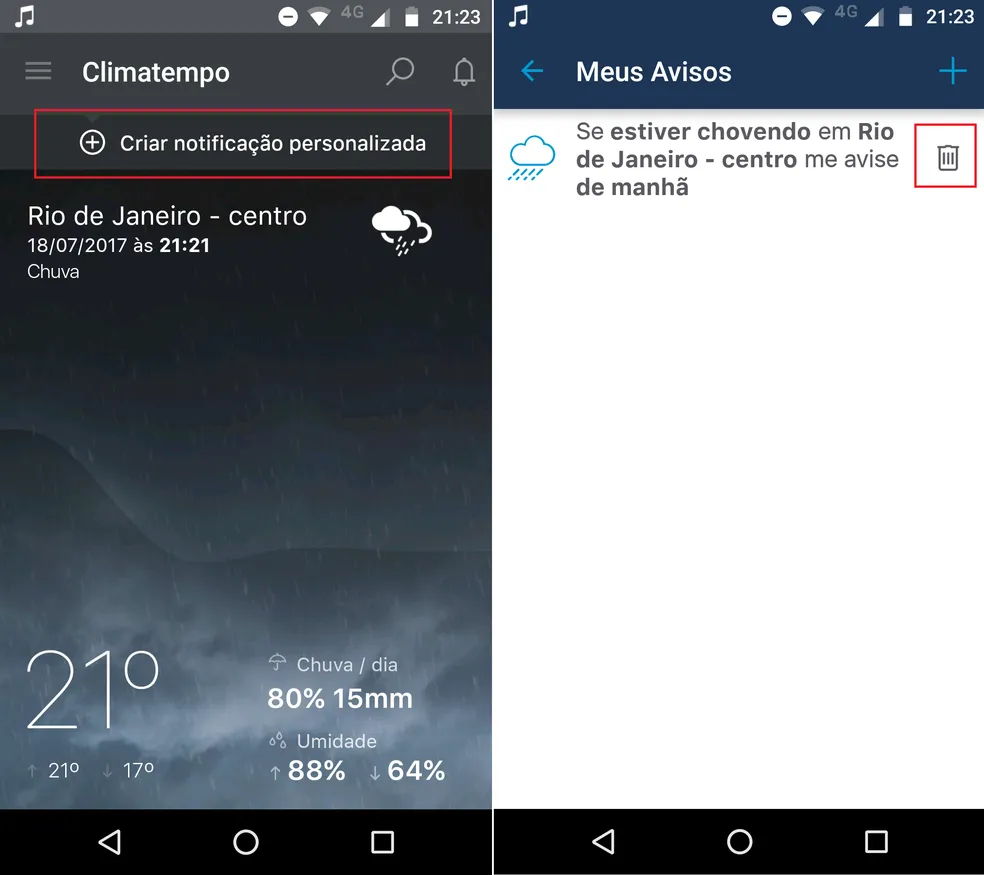

# Entrega 2 — Público-alvo e análise de concorrência

**Data:** 02/09/2026
**Status:** 🟨 em andamento
**Responsabilidade mínima:** cada integrante analisa pelo menos 1 concorrente/interface representativa; a equipe produz síntese comparativa.

## Objetivo da atividade

Compreender soluções do mesmo domínio **e também interfaces familiares ao público-alvo**. O objetivo não é copiar telas, mas identificar convenções, padrões, affordances percebidas, problemas recorrentes, expectativas e oportunidades de design.

> **Concorrente não precisa ser idêntico ao produto.** Pode atuar na mesma área, resolver objetivo semelhante ou disputar a mesma necessidade. Quando não houver concorrente direto, use produtos análogos e softwares que o público já utiliza.

### Para TCCs que não previam interface

Não procure apenas um “concorrente do algoritmo”. Investigue **interfaces profissionais que materializam atividades semelhantes** às que o usuário escolhido precisaria realizar.

Exemplos:

- TCC de banco de dados → consoles de administração, ferramentas para DBA, monitoramento e análise de consultas;
- TCC de LLM/ML → painéis de experimentos, gestão de modelos/datasets, comparação de métricas, revisão de resultados;
- TCC de análise de dados → dashboards, ferramentas de BI, filtros, relatórios e exploração;
- TCC de infraestrutura/API → portais administrativos, observabilidade, logs, gestão de credenciais e uso;
- TCC de cibersegurança → consoles de alertas, triagem, histórico e auditoria.

A pergunta é: **“que convenções esse perfil já conhece para executar tarefas equivalentes?”**

## Entrada obrigatória da Entrega 1

Retome o mapa inicial de alternativas e produtos citado na Entrega 1. Aqui a equipe deixa de trabalhar apenas com impressão inicial e passa a **investigar sistematicamente** cada solução.

| Softwares Mercado | Tipo | Razão | Status inicial | Decisão nesta entrega |
|---|---|---|---|---|
| Bayer - Field View | Análogo | Software renomado no mercado, com objetivos similares à certa parte da nossa interface | F | Analisar |
| John Deere Operations Center | Análogo | Software que traz uma grande visualização do que acontece no talhão. | F | Analisar |
| Croptimus™ Platform | Concorrente | Software muito semelhante com as intenções do que temos na interface prevista, assim como os objetivos do produto. | F | Analisar |
| Plantix | Concorrente | Software mobile com características muito similares ao que pretendemos utilizar, utiliza visão computacional e traz um layout interessante para isso. | F | Analisar |
| OneSoil Platform | Ferramenta Cotidiana | Software mobile sem objetivo específico bastante utilizado na comunidade agrícola, a ideia é extrair um estilo geral padrão, com navegação entre as utilidades/telas. | F | Analisar |

Se uma hipótese da Entrega 1 for confirmada ou refutada durante esta análise, atualize `H01`, `H02`... em [`../RASTREABILIDADE.md`](../RASTREABILIDADE.md).

## 1. Público-alvo desta análise

Trabalhadores rurais em geral, focando em dono de fazendo e controladores agrícolas.

## 2. Concorrentes diretos/indiretos

### Análise C01 — Bayer - Field View Ferramenta

**Autor(a):** Pedro Henrique Ferreira Valim - 24.123.048-1
**Tipo:** análogo  
**Link oficial:** https://climate.com/pt-br.html
**Data de acesso:** 02/09/2026

#### Contexto e proposta

O Climate FieldView é uma plataforma de **agricultura** digital que ajuda produtores rurais a **gerenciar suas fazendas de forma inteligente** através de dados coletados diretamente no campo.

#### Funcionalidades relevantes

| Funcionalidade | Como é realizada | Evidência/print | Observação de IHC |
|--- |---|---|---|
| **Monitoramento** | Através de mapas de satélite gerados frequentes que medem a densidade e a saúde da biomassa da lavoura. Ajuda a detectar anomalias, como ataques de pragas, doenças ou estresse hídrico, antes que fiquem visíveis a olho nu. Para auxiliar o monitoramento é possível marcar pontos específicos no mapa com fotos salvando as coordenadas exatas por GPS. |  | Os mapas são mais 'realistas' do que pensávamos, interessante para passar uma visão mais séria para o usuário. Os mapas ocupam bastante espaço na tela com ícones/botões de funcionalidade nas extremidades. |
| **Coleta e Integração de Dados em Tempo Real** | Realizada por um dispositivo físico conectado na entrada de dados das máquinas que transmite, via Bluetooth, dados de plantio, pulverização e colheita direto para o iPad ou celular. |  e  | A visualizações dos dados adquiridos em campos são bem precisar e também objetivas, sem muitas possibilidades de visualizações ao mesmo tempo, evitando a poluição visual. Poucos botões na tela e também possibilidade de filtro de talhão, facilitando a visão múltipla sem poluição. |
| **Análise de Resultados** | Cruza os dados do plantio com os da colheita para gerar relatórios automáticos mostrando qual variedade de semente (híbrido) rendeu mais e em qual tipo de solo ela teve melhor performance. |  | O que podemos observar é que o relatório pode ser exportado e obtido a parte, porém o software também opta por proporcionar uma visão rápida na própria tela do mapa, ou seja, o analista pode verificar os dados e observar os números de forma fácil... Também é interessante observar que mesmo com MUITOS dados no sistema, o relatório usa KPIs precisos e impactantes para o negócio. |

#### Experiência do usuário e opiniões

Alguns relatos interessante sobre a interface da plataforma que podem nos guiar para um desenvolvimento mais preparado para o mercado são:
- Design "Otimizado para Cabine" (Cab-Friendly): O aplicativo foi desenhado com botões grandes, poucos menus e fontes de alta legibilidade. --- Isso é muito interessante para os operadores de máquinas, que relatam fácil uso e visibilidade mesmo com condições não favoráveis para o uso.
- Também foi muito falado sobre a facilidade para aprender a usar a plataforma, o menu inicial contém poucos botões, consequentemente tendo poucos direcionamentos de tela. Assim fica fácil mesmo para quem não tem tanta afinidade ficar acostumado com o software.
- O ponto mais forte dos relatos são as visualizações de mapas lado a lado, tanto com mapas de volumes quanto com mapas de marcação, assim é interessante trazer insights como "Onde foi marcado o ponto, teve um aumento de concentração de pragas ou frutas mortas..."
- Um último ponto, agora negativo, muito citado pelo público alvo é a poluição visual na tela, principalmente com fazendo com uma alta carga de dados ao longo do tempo: "alguns gestores reclamam que o sistema de filtragem de mapas na interface poderia ser mais ágil, pois o menu de seleção tende a ficar longo e poluído visualmente."

**OBS**: Os dados foram retirados do vídeo que apresenta o software: https://www.youtube.com/watch?v=tBFafg21hnA&t=37s e também algumas avaliações na apple store.

#### Preço/modelo de negócio

Plano de Entrada (Prime): Custa cerca de R$ 250,00 por ano.
Plano Plus: Custa R$ 1.500,00 por ano.
FieldView Drive: O conector Bluetooth que vai acoplado na cabine custa em média R$ 980,00 a R$ 1.500,00 por unidade.

#### Padrões e tendências percebidos

Baixas opções de navegações entre as interfaces; Grande quantidade de dados nos mapas; Facilidade na observação de diferentes funções como mapas conjuntos, mostrando tendências e marcações e também relatórios gerados na interface de monitoramento dos mapas; Mais amplamente, as interfaces tendem sempre a ter uma visualização facilitada por conta das condições de campo.

#### Pontos positivos, limitações e lições

| Ponto | Evidência | Implicação para nosso projeto |
|---|---|---|
| Uma interface completa e em certa forma não poluída visualmente | Isso pode ser observado através das funcionalidade que nos trazem muitas informações relevantes para o negócio e também através dos relatos que podem ser visualizados acima, alguns usuários trazem um excesso de informação na tela assim como outros dizem ser 'clean' e de fácil compreensão. | Isso implica diretamente no nosso projeto pensando na _feature_ de **geolocalização** para interpretação do comportamento das pragas, infestações e pontos estratégicos para aplicação de produtos agrícolas.  |
| Facilidade de navegação pela plataforma e aplicações conjuntas | Aqui conseguimos perceber isso observando as imagens atreladas no documento, todas as interfaces tem poucos botões e os relatórios são gerados no mesmo menu do monitoramento. Também foi um ponto relatado pelos usuários. | Novamente aqui é muito bom para entendermos como gerar os relatórios das pragas para que os gestores consigam analisar e gerar insights para agir sobre. |

### Análise C02 — Plantix

**Autor(a):** Guilherme Morais Escudeiro — 24.123.005-1
**Tipo:** direto 
**Link oficial:** https://plantix.net/pt/  
**Data de acesso:** 02/09/2026

#### Contexto e proposta

Aplicativo mobile que ajuda agricultores e jardineiros a diagnosticar doenças, pragas e deficiências nutricionais em plantas através de fotos tiradas pelo celular

#### Funcionalidades relevantes

| Funcionalidade | Como é realizada | Evidência/print | Observação de IHC |
|---|---|---|---|
| Diagnóstico por foto | O usuário tira uma foto da planta doente e recebe o identificação do problema em segundos  |  | Para tirar a foto, o app utiliza interface similar a interface padrão dos OSes dos celulares populares (aumenta a facilidade do uso), incluindo uma funcionalidade que fornece feedback em tempo real se o enquadramento está bom antes de tirar a foto. |
| Tratamentos recomendados | O aplicativo recomenda tratamentos convencionais e métodos de controle preventivo da doença identificada |  | O app permite ouvir o texto das recomendações dadas, algo que apoia o usuário com dificuldade de leitura. |
| Alerta de doenças próximas | Utilizando sua localização, o aplicativo fornece alertas de doenças próximas identificadas em sua região. |  | O alerta é regional (por área), não pontual — diferente da geolocalização por GPS individual de árvore/talhão que estamos propondo, o que é um diferencial relevante do nosso projeto. |

#### Experiência do usuário e opiniões

O aplicativo possui uma nota média de 4,6 estrelas na Play Store, analisando as avaliações do app, encontram-se as seguintes opiniões:

Elogios:
- Eficácia no aprendizado agrícola: Profissionais da área relatam que o app ajuda no dia a dia do campo e funciona como uma excelente ferramenta de aprendizado prático.
- Precisão do diagnóstico por imagem: Os usuários destacam a rapidez e a assertividade da inteligência artificial ao detectar mais de 400 a 780 tipos de danos e pragas em segundos através de uma simples foto.
- Utilidade dos recursos extras: A calculadora de fertilizantes, os alertas locais de doenças e a previsão do tempo integrada recebem avaliações muito positivas por auxiliarem no gerenciamento completo da lavoura.
- Rede social interna: A seção de comunidade é elogiada por permitir a troca de ideias e experiências diretamente com outros agricultores e especialistas do setor.

Críticas:
- Limitações na interação social: Há reclamações de que a aba da comunidade carece de recursos básicos de redes sociais, como a impossibilidade de buscar perfis de membros específicos, ver quem seguiu você ou interagir por mensagens diretas privadas.
- Restrição de culturas: Usuários focados em jardinagem doméstica apontam que o catálogo de diagnóstico é estrito a 30 grandes culturas comerciais (como milho, soja e tomate), deixando a desejar para plantas ornamentais comuns.
- Preocupações com privacidade de dados: A seção de segurança de dados gera ressalvas de alguns usuários na Play Store, já que o aplicativo exige o compartilhamento de informações como localização aproximada, atividade do app e IDs do dispositivo com terceiros.

#### Preço/modelo de negócio

O aplicativo é gratuito, porém, quando o app diagnostica uma praga, ele recomenda produtos (defensivos químicos ou biológicos) e conecta o produtor a lojas e fornecedores locais. A empresa recebe comissões pelas vendas geradas por meio dessa integração.
Além disso, utilizando o mesmo ecossistema do aplicativo, a empresa oferece soluções B2B focadas no mercado agrícola, como licenciamento do software para ser integrado em outras soluções, e o uso dos dados gerados pelo aplicativo para que as empresas entendam o comportamento agrícola regional.

#### Padrões e tendências percebidos

- A interface de captura de foto replica a câmera nativa do sistema operacional, reduzindo a curva de aprendizado, reaproveitando modelos mentais já consolidados pelo usuário.
- O resultado do diagnóstico aparece de forma rápida e direta ("problema identificado em segundos"), evitando sobrecarga cognitiva num momento em que o usuário está no campo e quer uma resposta objetiva.

#### Pontos positivos, limitações e lições

| Ponto | Evidência | Implicação para nosso projeto |
|---|---|---|
| Acessibilidade para usuários com dificuldade de leitura | O app permite ouvir o texto das recomendações de tratamento, atendendo usuários com dificuldade de leitura ou em contexto de "mãos ocupadas" no campo.| Adicionar opção de áudio para explicação da doença pode ampliar a acessibilidade do nosso app, especialmente para uso em campo, onde ler a tela nem sempre é prático. |
| Feedback em tempo real na captura de imagem | O app fornece indicação visual se o enquadramento da foto está adequado antes da captura, prevenindo erros de diagnóstico por imagem ruim. | Implementar feedback similar (ex: indicador de foco, distância ou iluminação) pode reduzir erros de captura e aumentar a confiabilidade do diagnóstico no nosso app. |
| Desalinhamento entre modelo mental do usuário e funcionalidade social oferecida | Usuários criticam a ausência de recursos básicos esperados de redes sociais (buscar perfis, seguir, mensagens diretas) na comunidade do app. | Caso implementemos funcionalidades sociais/comunitárias, é importante alinhar com convenções já conhecidas pelo usuário. |

### Análise C03 — OneSoil Platform 

**Autor(a):** Lucas Tonoli Cabral Duarte R.A: 24.123.032-5  
**Tipo:** análogo  
**Link oficial:** https://onesoil.ai/pt/solutions/farmers  
**Data de acesso:** 02/09/2026

#### Contexto e proposta

 É uma plataforma global de agricultura de precisão que utiliza imagens de satélite e inteligência artificial para simplificar o gerenciamento de lavouras.

#### Funcionalidades relevantes
| Funcionalidade | Como é realizada | Evidência/print | Observação de IHC |
|---|---|---|---|
| Mapeamento | Dividir o talhão em regiões de alto, médio e baixo potencial de rendimento para planejar onde investir mais insumos |  | A interface do mapa deve garantir alta densidade de informação visual e baixo esforço cognitivo: os talhões precisam ter delimitações gráficas distintas e carregamento de imagem de satélite em alta resolução, permitindo ao usuário navegar via geolocalização sem ambiguidades. |
| Criação de mapas de precisão | Cria arquivos de configuração para que os tratores e pulverizadores apliquem quantidades diferentes de fertilizantes ou sementes em cada ponto do campo de acordo com a necessidade |  | A criação desses mapas de precisão deve garantir alta qualidade de informação visual de modo a ser específico ao mostrar as informações necessárias para cada um dos mapas |
| Inspeção de Campo Otimizada | Direciona a equipe de campo exatamente para os pontos críticos da lavoura, economizando tempo de inspeção. |  | A interface de inspeção é otimizada para dispositivos móveis com alto contraste para visualização sob luz solar direta. O aplicativo permite o registro rápido de pragas e fotos com poucos cliques, oferecendo navegação por GPS em tempo real e funcionamento 100% offline |

#### Experiência do usuário e opiniões

- "Experimentei várias aplicações para mapas VRA, e a OneSoil destaca-se. A qualidade dos mapas VRA para a aplicação de azoto é a melhor entre as outras aplicações que experimentei. Tornou-se uma ferramenta indispensável."
- "A OneSoil é uma plataforma que permite aos produtores tomar decisões informadas sem esforço, com uma utilização simples e interativa. O seu design intuitivo e as informações de dados abrangentes transformaram o nosso processo de tomada de decisões."
- "A poupança é substancial. A OneSoil ajudou-nos a poupar 11 USD por hectare com a aplicação de taxa variável. Esta solução económica não só impulsionou os nossos resultados, como também promoveu práticas agrícolas sustentáveis."
  
#### Preço/modelo de negócio

Uso para agricultores: As ferramentas básicas de monitoramento de lavouras via satélite, índices de vegetação (NDVI) e histórico de campos são gratuitas no aplicativo e na web.
Para empresas e parceiros: Soluções corporativas, de revenda de insumos ou pacotes voltados para prestadores de serviços agrícolas possuem preços sob consulta, disponíveis mediante solicitação direta no site oficial.

#### Padrões e tendências percebidos

- Há um padrão de mapeamento de talhões com informações relevantes onde, para que ele funcione, seguem um padrão automatizado baseado em inteligência artificial e imagens de satélite.
- Há um padrão de interface de inspeção onde, para que ele funcione, seguem um padrão de interface limpa, com pouca poluição visual e poucos caminhos até chegar à funcionalidade requisitada e utilizam inteligência artificial para funcionalidade de inspeção

#### Pontos positivos, limitações e lições

| Ponto | Evidência | Implicação para nosso projeto |
|---|---|---|
| Facilidade de visualizar mapas | A evidência disso são os relatos positivos apresentados no site e a funcionalidade apresentada nas fotos | Isso implica diretamente no nosso sistema de monitoramento e mapeamento a partir de inteligência artificial e imagens de satélite |
| Facilidade ao usar o app |A evidência dessa facilidade está nos relatos dos clientes que já utilizaram o app e nas fotos que há na internet sobre | Isso implica diretamente no nosso app, onde utiliza uma interface característica para trabalhadores rurais utilizando inteligência artificial |

## 3. Softwares que o público-alvo usa no cotidiano

| Software | Por que o público usa | Padrões relevantes | Prints | O que aprender |
|---|---|---|---|---|
| WhatsApp | Principal canal de comunicação no campo — envio de fotos de pragas/doenças para agrônomos, grupos de cooperativa, áudios em vez de texto | Botão de câmera em destaque, envio de áudio com um toque, preview de imagem antes de enviar, indicadores de status (enviado/lido) |  | O hábito de mandar áudio em vez de digitar reforça a importância de leitura/gravação em voz no nosso app; preview de foto antes de confirmar envio é um padrão já internalizado que podemos reaproveisar na tela de captura |
| Google Maps / Waze | Navegação até talhões, fornecedores, cooperativas; alguns usam para localizar pontos dentro da própria propriedade | Marcação de pin em localização específica, zoom por gesto, alto contraste em modo satélite, ícones grandes tocáveis |  | O padrão de "marcar um pino no mapa e adicionar uma nota/foto" é praticamente idêntico à funcionalidade de geolocalização por talhão que estamos propondo |
| Aplicativo de previsão do tempo (ex: Climatempo) | Decisão de quando pulverizar, colher ou irrigar depende diretamente da previsão | Ícones grandes e universais (sol, chuva), informação resumida no topo da tela, alertas push para eventos críticos |  | Uso de ícones universais em vez de texto extenso é um padrão a seguir para diagnósticos rápidos; alertas push já são esperados quando há "risco" (ex: praga detectada perto) |

## 3.1 Padrões de interface relevantes ao escopo de IHC

Registre somente padrões encontrados nas soluções analisadas e que possam ter relação com objetivos reais da equipe.

| Padrão observado | Produto(s) | Para qual tarefa serve | Vantagem percebida | Risco/limitação | Aplicável ao nosso escopo? |
|---|---|---|---|---|---|
| Mapa com zonas de risco/potencial coloridas | C01 (FieldView), C03 (OneSoil) | Orientar visualmente onde agir no talhão | Alta densidade de informação com baixo esforço cognitivo | Pode poluir a tela se houver muitos dados sobrepostos (relatado por usuários do C01) | Sim, é exatamente o que o módulo de mapeamento do talhão do projeto faz |
| Relatório automático comparativo | C01 (FieldView) | Cruzar dados e gerar insight de negócio (ex: rendimento por variedade) | Visão rápida sem sair da tela do mapa | Pode ficar denso com muitos dados acumulados | Talvez, poderia comparar zonas de infestação/tratamento ao longo do tempo |
| Histórico + filtro por talhão | C01 (FieldView) | Focar a visualização em uma área específica | Facilita visão múltipla sem poluição | Usuários relatam que o menu de filtros fica longo e poluído | Sim, com cuidado — aplicar filtro simples por talhão/data, evitando o erro relatado no C01 |
| Feedback de enquadramento em tempo real na captura de foto | C02 (Plantix) | Garantir que a foto tirada tenha qualidade suficiente para o diagnóstico por IA | Reduz fotos inutilizáveis, aumenta taxa de acerto do modelo | Depende de boa iluminação | Sim — essencial, já que o ácaro é sub-milimétrico e exige distância focal e foco precisos (AE/AF Lock) |
| Administração/CRUD | Não observado claramente em C01/C02/C03 | — | — | — | Não parece um padrão relevante para o público final (trabalhador de campo) |

> O objetivo não é concluir “todo concorrente tem dashboard, então teremos um”. O padrão só será adotado se apoiar uma tarefa rastreável.

## 4. Síntese comparativa da equipe

| Critério | C01 (FieldView) | C02 (Plantix) | C03 (OneSoil) | Oportunidade para o projeto |
|---|---|---|---|---|
| Navegação | Poucos botões, mapas lado a lado, poucos direcionamentos de tela | Fluxo curto: abrir câmera → foto → resultado | Navegação simples entre mapeamento e inspeção | Manter fluxo de poucos toques entre "abrir app → foto → resultado geolocalizado" |
| Feedback/estado | Mapas de biomassa atualizados detectam anomalias visualmente | Feedback em tempo real do enquadramento antes de capturar | Cores indicam potencial de rendimento por região do talhão | Dar feedback imediato sobre qualidade/distância do enquadramento, crítico para captura de alvo sub-milimétrico |
| Prevenção/recuperação de erro | Travamento de foco/exposição; funcionamento offline evita perda de dados | Guia visual evita fotos mal enquadradas | Não relatado claramente | Aplicar AE/AF Lock e orientar a distância mínima de foco, conforme protocolo de captura do TCC |
| Terminologia | Termos técnicos agronômicos (híbrido, taxa variável) | Linguagem simples voltada ao leigo | Mistura termos técnicos com simples | Priorizar linguagem simples, como o Plantix, dado o público de trabalhadores de campo |
| Acessibilidade | Alto contraste para uso sob luz solar direta | Leitura em áudio das recomendações | Alto contraste também citado | Combinar alto contraste + leitura em áudio |
| Eficiência | Poucos cliques, menu inicial enxuto | Diagnóstico em segundos | Navegação rápida entre funcionalidades | Minimizar etapas entre captura e resultado georreferenciado, replicando eficiência dos três |

## 5. Recomendações derivadas

- **RC01:** A interface de captura deve fornecer feedback em tempo real sobre qualidade/distância do enquadramento antes de registrar a foto derivada de C02 e do protocolo de captura (AE/AF Lock) definido no TCC.
- **RC02:** Priorizar alto contraste visual e fontes grandes para uso sob luz solar direta em campo — derivada de C01 e C03.
- **RC03:** Oferecer leitura em áudio de diagnósticos/informações, derivada de C02, para ampliar acessibilidade a usuários com dificuldade de leitura.
- **RC04:** Garantir funcionamento 100% offline com sincronização posterior, derivada de C03 e da arquitetura de Edge Computing (TensorFlow Lite) do projeto.
- **RC05:** Gerar mapas de foco de infestação e zona de risco adjacente (não apenas pontos isolados), derivada de C01 e C03, e diretamente do módulo de geolocalização via EXIF do TCC.
- **RC06:** Evitar poluição visual em telas com muitos dados, derivada da crítica de usuários do C01 sobre menu de filtros longo.
- **RC07:** Ser transparente sobre o uso de dados de localização coletados via GPS/EXIF, derivada da crítica de privacidade relatada em C02.

## Referências

- Climate FieldView (Bayer). Disponível em: https://climate.com/pt-br.html
- Plantix. Disponível em: https://plantix.net/pt/
- Avaliações de usuários — Google Play Store (Plantix)
- OneSoil Platform. Disponível em: https://onesoil.ai/pt/solutions/farmers
  
## Checklist

- [ ] O mapa inicial de alternativas da Entrega 1 foi revisitado e aprofundado.
- [ ] Hipóteses relevantes sobre mercado/padrões foram atualizadas na rastreabilidade quando surgiram evidências.
- [ ] Há pelo menos uma análise completa por integrante.
- [ ] Cada análise contém prints legíveis da interface.
- [ ] Prints mostram telas/estados relevantes, não apenas logos/homepage.
- [ ] Foram analisados concorrentes e/ou interfaces representativas ao público.
- [ ] Em TCC sem interface original, foram investigadas ferramentas profissionais análogas às atividades do usuário escolhido.
- [ ] Padrões como dashboard, relatório, filtros e CRUD foram analisados como soluções para tarefas, não como requisitos automáticos.
- [ ] Opiniões de UX têm fonte.
- [ ] A síntese compara critérios comuns e produz recomendações.
- [ ] Não há “copiar porque o concorrente faz”; há justificativa de adequação ao público/contexto.
