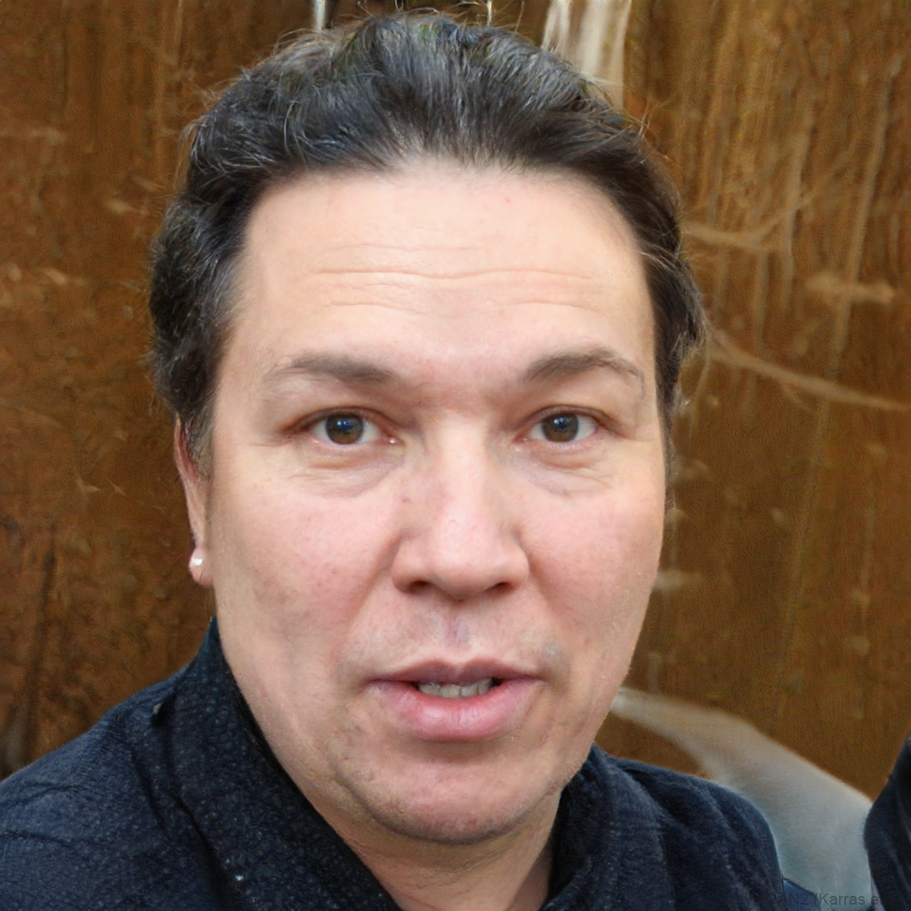
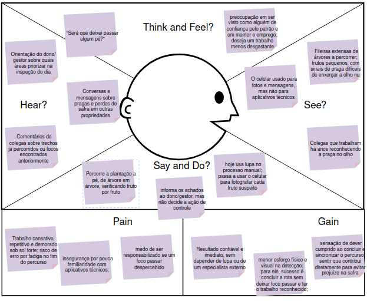

# Entrega 3 — Personas, mapa de empatia, contexto de uso e jornada

**Data:** 09/09/2026 
**Status:** 🟨 em andamento
**Responsabilidade:** 1 persona por integrante; 1 mapa de empatia, 1 contexto de uso consolidado e 1 jornada por equipe (salvo orientação diferente do docente).

## Objetivo da atividade

Representar grupos de usuários de forma útil para decisões de design. Persona não é personagem decorativo: suas características devem alterar requisitos, prioridades, linguagem, fluxos ou critérios de avaliação.

## Atenção a projetos técnicos

Em TCCs sem interface original, a persona pode representar um **profissional que se apropria da contribuição técnica**: DBA, analista, cientista de dados, administrador, pesquisador, técnico, operador, gestor ou especialista de domínio.

Não escolha um perfil apenas porque "parece combinar" com a tecnologia. Explique **qual objetivo esse perfil teria e qual parte da contribuição do TCC produziria valor para ele**. Se ainda for hipótese, mantenha como hipótese/proto-persona a validar.

Também considere papéis diferentes quando houver tarefas distintas, por exemplo:

- operador que executa análises;
- administrador que configura e gerencia permissões;
- especialista que interpreta resultados;
- gestor que consulta relatórios e decide;
- auditor que revisa histórico.

## Entradas da Entrega 1

Antes de criar personas, retome os tipos de usuários, características relevantes, objetivos e hipóteses registradas na Entrega 1. A persona **não deve transformar uma hipótese inicial em fato por meio de uma história fictícia**.

| Item da Entrega 1 | Status inicial | Evidência disponível agora | Como será tratado nesta entrega |
|---|---|---|---|
| Pessoas que trabalham na fazenda | F | [F31] | incorporar |
| Dono/gestor da fazenda | F | [H19] | incorporar |
| Verificar os frutos em busca de sinais da praga | F | [F16] O trabalho descreve a inspeção como atividade recorrente | incorporar |
| Decidir onde e quando aplicar o produto de controle | F | [H04] Ainda não confirmado quem exatamente toma essa decisão no dia a dia | incorporar |
| Acompanhar se o problema está se espalhando pela propriedade | F | [H05] Ainda não confirmado como esse acompanhamento é feito hoje | incorporar |
| As pessoas da fazenda já usam celular no dia a dia, mas não necessariamente têm prática com aplicativos técnicos. | F | [F12] | incorporar |
| O trabalho de campo é feito ao ar livre, muitas vezes com pouco ou nenhum sinal de internet. | F | [F13] | incorporar |
| Agrônomo da propriedade participa da definição do período de coleta de dados, junto à equipe | F | [F08] | incorporar |

## 1. Personas

### Persona P01, Jaime Carteiro

**Autor(a):** Pedro Henrique Ferreira Valim - 24.123.048-1  
**Tipo:** primária  
**Base de evidências:** entrevista / observação   
**Hipóteses da Entrega 1 relacionadas:** H04, H05, H21

*Imagem ilustrativa gerada por IA (thispersondoesnotexist.com); não retrata uma pessoa real.*

| Campo | Descrição |
|---|---|
| contexto relevante | Pessoa com responsabilidade de gestão administrativa e estratégica da fazenda (dono, gerente etc.). |
| Ocupação/papel | Dono da Fazenda |
| Conhecimento do domínio | Administrativo |
| Experiência tecnológica | Pouco |
| Objetivos | Identificar os focos de infestação para embasar a tomada de decisão sobre manejo. |
| Necessidades | Ter acesso a dados confiáveis sobre os focos de infestação para orientar as ações de manejo. |
| Dores/frustrações | Dependência do profissional "pragueiro" para detecção e mapeamento de pragas. |
| Motivadores | Ganhar autonomia na detecção e no monitoramento de pragas, reduzindo a dependência de terceiros. |
| Restrições/acessibilidade | Baixo conhecimento técnico para identificar a praga por conta própria; depende da confiabilidade do sistema para validar os alertas recebidos. |
| Ambiente típico de uso | Escritório da propriedade, com visitas eventuais ao talhão para acompanhamento. |
| Comportamentos relevantes | Acompanha periodicamente as métricas e mapas do aplicativo para obter uma visão macro da propriedade e apoiar decisões estratégicas. |

**Decisões de design influenciadas por P01:**

- Interface com características 'clean' e objetivas.
- Diferentes visões de mapas e pontos de infestações.
- Menu lateral de métricas e dados mais especificados sobre os resultados obtidos em campo.

### Persona P02, Antônio Ferreira

**Autor(a):** Lucas Tonoli Cabral Duarte - 24.123.032-5  
**Tipo:** primária  
**Base de evidências:** hipótese (a validar em entrevista/observação de campo)  
**Hipóteses da Entrega 1 relacionadas:** H03, H09, H20

*Imagem ilustrativa gerada por IA (thispersondoesnotexist.com); não retrata uma pessoa real.*

| Campo | Descrição |
|---|---|
| contexto relevante | Trabalhador rural que realiza a inspeção direta da plantação em busca de sinais da praga, sem formação técnica em agronomia. |
| Ocupação/papel | Trabalhador de campo / inspetor de pragas ("pragueiro") |
| Conhecimento do domínio | Alto conhecimento prático de campo (reconhece sinais visuais de praga por experiência), baixo conhecimento técnico/digital |
| Experiência tecnológica | Pouco |
| Objetivos | Verificar os frutos em busca de sinais da praga de forma rápida e confiável, sem depender de equipamento extra como lupa |
| Necessidades | Confirmação clara e imediata se há ou não sinal de praga; aplicativo funcionando mesmo sem internet |
| Dores/frustrações | Trabalho cansativo, repetitivo e demorado; sol forte; risco de deixar um foco de infestação passar despercebido no fim do dia |
| Motivadores | Realizar a inspeção corretamente sem se desgastar tanto; contribuir para evitar prejuízo na safra |
| Restrições/acessibilidade | Dificuldade de leitura extensa em tela pequena sob luz solar direta; pouca familiaridade com aplicativos técnicos |
| Ambiente típico de uso | A pé, entre as árvores, ao ar livre, sob sol forte, com pouco tempo disponível por planta e sem sinal de internet |
| Comportamentos relevantes | Tira a foto, olha o resultado na hora e segue para a próxima árvore; normalmente informa o achado, mas não é quem decide a ação a ser tomada |

**Decisões de design influenciadas por P02:**

- Botão de captura grande, de fácil acesso com uma mão, sem exigir múltiplos toques para tirar a foto.
- Resultado exibido com ícones/cores (ex.: sinal verde/vermelho) em vez de texto longo, para leitura rápida sob sol.
- Feedback em tempo real de enquadramento antes de tirar a foto, evitando capturas ruins.
- Funcionamento 100% offline, com sincronização automática quando houver conexão.
- Alto contraste visual para uso sob luz solar direta.
- Possível leitura em voz de instruções simples, para reduzir dependência de leitura em tela.
  
### Persona P03, Marcelo Fidalgo

**Autor(a):** Guilherme Morais Escudeiro - 24.123.005-1  
**Tipo:** primária  
**Base de evidências:** fato (participação confirmada na definição do período de coleta) + hipótese (extensão do papel para validação técnica dos resultados)  
**Hipóteses da Entrega 1 relacionadas:** H04, H07

*Imagem ilustrativa gerada por IA (thispersondoesnotexist.com); não retrata uma pessoa real.*

| Campo | Descrição |
|---|---|
| contexto relevante | Profissional de agronomia que presta consultoria técnica à propriedade, com formação especializada em fitossanidade e manejo de citros; não está presente no dia a dia do campo. |
| Ocupação/papel | Agrônomo consultor da propriedade |
| Conhecimento do domínio | Alto conhecimento técnico/científico sobre pragas, fitossanidade e manejo de citros |
| Experiência tecnológica | Moderada, usa e-mail, planilhas e relatórios técnicos; pouco contato com aplicativos de campo |
| Objetivos | Validar tecnicamente os focos de infestação identificados e recomendar o manejo mais adequado (produto, dose, período de aplicação) |
| Necessidades | Acesso a dados históricos e geolocalizados das inspeções, com detalhe técnico suficiente para embasar um parecer |
| Dores/frustrações | Hoje recebe informações informais e incompletas do campo (relatos verbais, fotos soltas sem contexto), o que dificulta um diagnóstico preciso e a comparação ao longo do tempo |
| Motivadores | Emitir recomendações tecnicamente embasadas, evitando aplicação incorreta ou desnecessária de defensivos |
| Restrições/acessibilidade | Não acompanha a propriedade presencialmente no dia a dia; depende inteiramente dos dados repassados pelo aplicativo para decidir remotamente |
| Ambiente típico de uso | Escritório próprio ou de outra propriedade, consultando remotamente os dados enviados pela equipe de campo, com visitas técnicas pontuais |
| Comportamentos relevantes | Analisa o histórico de ocorrências e a distribuição espacial dos focos antes de emitir um parecer técnico, cruzando dados de diferentes inspeções ao longo do tempo |

**Decisões de design influenciadas por P03:**

- Histórico de inspeções com filtro por período e localização, não apenas o resultado mais recente.
- Visualização detalhada dos metadados de cada detecção (data, geolocalização, imagem original) para suportar parecer técnico remoto.
- Diferenciação clara entre "sinal detectado pela IA" e "confirmação/validação humana", para rastrear os casos que passaram por análise especializada.

### Síntese das personas

P01 decide com base em dados agregados, no escritório, pouco exposto ao campo, P02 coleta a informação direto na plantação, sob sol, sem internet, e P03 interpreta remotamente o histórico técnico para validar o diagnóstico e recomendar o manejo. São papéis complementares, não sobrepostos, e as três personas são **primárias**, pois todas interagem diretamente com o aplicativo: P02 no fluxo de captura, P01 no mapa e nas métricas, P03 no histórico técnico. Entre elas, P02 é a prioridade do fluxo principal, pois é quem realiza a interação de captura e recebe o resultado, fluxo definido como escopo de IHC na Entrega 1.

## 2. Mapa de empatia — equipe

**Persona escolhida:** P02, Antônio Ferreira  
**Justificativa:** P02 é a persona prioritária da equipe (ver Síntese das personas), pois é quem executa a interação de captura de imagem e recebe o resultado da detecção, fluxo definido como escopo de IHC na Entrega 1. Entender profundamente seu contexto emocional e físico é o que mais influencia decisões de interface do fluxo principal.

| Dimensão | Descrição | Status |
|---|---|---|
| O que vê | No trabalho: fileiras extensas de árvores a percorrer; frutos pequenos, com sinais de praga difíceis de enxergar a olho nu; sol forte incidindo sobre a plantação; ausência de barras de sinal no celular. No cotidiano: colegas que trabalham há anos reconhecendo a praga "no olho"; propriedades vizinhas que já tiveram prejuízo com pragas; o celular usado para fotos e mensagens, mas não para aplicativos técnicos | [F19], [F21], [F23], [F13], [F12]; cotidiano: hipótese |
| O que ouve | Orientação do dono/gestor sobre quais áreas priorizar na inspeção do dia; comentários de colegas sobre trechos já percorridos ou focos encontrados anteriormente; conversas e mensagens (grupos de WhatsApp da fazenda/região, rádio) sobre pragas e perdas de safra em outras propriedades | hipótese |
| O que diz/faz | Percorre a plantação a pé, de árvore em árvore, verificando fruto por fruto; hoje usa lupa no processo manual; passa a usar o celular para fotografar cada fruto suspeito; informa os achados ao dono/gestor, mas não decide a ação de controle; comenta com os colegas onde "achou bicho" e troca fotos pelo celular | [F18], [F22], [F24]; conversa com colegas: hipótese |
| O que pensa/sente | "Será que deixei passar algum pé?"; no início do percurso, disposição e rotina conhecida; ao longo do dia, cansaço crescente e receio de deixar um foco passar despercebido justamente nos últimos pés de laranja; ansiedade breve na espera pelo resultado da análise; alívio quando não há sinal de praga, atenção redobrada quando há. Fora da tarefa: preocupação em ser visto como alguém de confiança pelo patrão e em manter o emprego; deseja um trabalho menos desgastante | [F19], [F21], [H08]; preocupações pessoais: hipótese |
| Dores | Trabalho cansativo, repetitivo e demorado sob sol forte; risco de erro por fadiga no fim do percurso; possível impedimento do uso do app por falta de internet; insegurança por pouca familiaridade com aplicativos técnicos; medo de ser responsabilizado se um foco passar despercebido | [F19], [H08], [F13], [H03], [F25]; responsabilização: hipótese |
| Ganhos | Resultado confiável e imediato, sem depender de lupa ou de um especialista externo; menor esforço físico e visual na detecção; para ele, sucesso é concluir a rota sem deixar foco passar e ter o trabalho reconhecido; sensação de dever cumprido ao concluir e sincronizar o percurso; sentir que contribui diretamente para evitar prejuízo na safra | [F03], [F04], [F14], [F15]; reconhecimento: hipótese |

## 3. Contexto de uso, consolidação

| Dimensão | Descrição | Implicação de design |
|---|---|---|
| Usuários | Três personas primárias: P02 (trabalhador de campo/pragueiro) no fluxo de captura, P01 (dono/gestor) no mapa/métricas, P03 (agrônomo consultor) no histórico técnico e validação remota. | Interface precisa comportar níveis de uso distintos: operacional e rápido em campo, analítico em consulta no escritório e técnico/detalhado para o parecer remoto. |
| Tarefas | A01, verificar frutos em busca de sinais da praga (P02), A02, decidir onde/quando aplicar controle (P01, com recomendação de P03), A03, acompanhar disseminação do problema (P01, P03). | Fluxo de captura precisa ser curto e direto, fluxo de mapa e histórico precisa sustentar comparação ao longo do tempo. |
| Equipamentos | Smartphone com câmera, eventualmente com lente macro acoplada. | Botões grandes e alcançáveis com uma mão, app deve tolerar variação de hardware entre dispositivos. |
| Ambiente físico | Campo aberto, sol forte, calor, deslocamento constante entre árvores, pouco tempo por planta [F21], [F23]. Piso de terra irregular entre as fileiras; iluminação variando entre sol direto (reflexo na tela) e sombra das copas; obstáculos como galhos e frutos em alturas diferentes; mãos possivelmente sujas ou suadas (hipótese). P01 e P03 usam o app em escritório, sob condições controladas. | Alto contraste, textos curtos, pouca dependência de leitura extensa, alvos de toque grandes e operação com uma mão. |
| Ambiente social/organizacional | Quem inspeciona nem sempre é quem decide a ação, há uma etapa de comunicação entre P02, P01 e P03 [F24]. Em campo, o trabalhador tende a seguir a rota orientada pelo gestor, trabalhar em ritmo contínuo e trocar informações com colegas sobre focos encontrados (hipótese). | App precisa deixar claro o repasse da informação, como alerta visível para o gestor e dados acessíveis ao agrônomo, sem exigir decisão do trabalhador de campo. |
| Papéis/permissões/governança | Ainda não confirmado se haverá diferenciação formal de perfil/login entre trabalhador e gestor. | Lacuna a investigar nas próximas entregas, relacionada a H21. |
| Volume de dados/histórico | Inspeções são recorrentes ao longo do ano [F16], necessidade de histórico ainda é hipótese, reforçada pela necessidade de P03. | Justifica prototipar uma versão simples de histórico/mapa acumulado, relacionado a H09 e H22. |

---

## 4. Jornada do usuário, equipe

**Persona:** P02, Antônio Ferreira  
**Objetivo da jornada:** Inspecionar os frutos da propriedade e reportar, de forma confiável, se há sinais da praga em cada ponto percorrido.  
**Início e fim da jornada:** Começa no primeiro contato com o aplicativo (recebê-lo e usá-lo pela primeira vez) e segue pela rota de inspeção do dia; termina ao encerrar o percurso e ter a confirmação de que os dados foram sincronizados quando há conexão.

| Etapa | Situação/ação | Objetivo | Pensamento/emoção | Dor | Oportunidade de design | Evidência |
|---|---|---|---|---|---|---|
| 0 | Recebe o aplicativo instalado no celular e é orientado pelo gestor a usá-lo na inspeção | Entender como usar o app sem atrasar o trabalho | "Mais uma coisa no celular... será que é difícil?"; desconfiança e insegurança | Pouca familiaridade com aplicativos técnicos | Primeiro uso guiado, curto e visual, levando direto à captura | F12, H03, H20 |
| 1 | Chega à propriedade e inicia o percurso de inspeção entre as árvores | Começar a rota do dia | "Hoje é mais um dia de rota"; disposição, rotina já conhecida | Percurso longo pela frente, calor já presente | Indicar de forma simples por onde continuar, se houver histórico de rota | F21, H09 |
| 2 | Posiciona o smartphone sobre o fruto para capturar a imagem | Obter uma foto de qualidade suficiente para a detecção | "Será que essa foto ficou boa?"; concentração, incerteza | Dificuldade de manter distância/foco adequados sem apoio de lupa | Feedback visual em tempo real de enquadramento e distância antes da captura | F22, RC01, Entrega 2 |
| 3 | Aguarda o resultado da análise diretamente no app | Saber se há sinal da praga naquele ponto | "Tem bicho ou não tem?"; ansiedade breve | Falta de internet poderia impedir o resultado | Processamento offline, resposta em poucos segundos | F13, RC04, Entrega 2 |
| 4 | Vê o resultado indicado na tela | Confirmar se precisa agir ou seguir em frente | "Posso seguir" ou "preciso avisar o patrão"; alívio ou atenção | Texto técnico demais poderia confundir | Resultado com ícone ou cor de leitura rápida | H03, RC02, Entrega 2 |
| 5 | Segue para a próxima árvore repetindo o processo | Cobrir o máximo de pontos possível no tempo disponível | "Falta muito ainda?"; cansaço crescente | Fadiga aumenta risco de pular pontos ou apressar a captura | Fluxo com o mínimo de toques entre foto e resultado | F18, F19, H08 |
| 6 | Ao final do percurso, ou quando há sinal, o app sincroniza os dados com o servidor central | Repassar os achados para quem decide | "Será que chegou lá?"; dever cumprido, com dúvida sobre o envio | Não saber se a sincronização realmente ocorreu | Indicação clara de status de sincronização | F24, RC04, Entrega 2 |

---

## Síntese

- O fluxo de captura, feedback de enquadramento, resultado imediato e sincronização posterior precisa aparecer nos cenários e no modelo de tarefas da Entrega 5.
- O repasse de informação entre P02, P01 e P03, já que quem inspeciona nem sempre decide, deve virar um requisito explícito de fluxo, não só de tela.
- O primeiro uso do app (etapa 0 da jornada) e o feedback não punitivo, vindos do mapa de empatia, devem ser considerados na prototipação.
- As hipóteses H03, H09 e H21, além da camada social do mapa de empatia, seguem em aberto e devem orientar a investigação da Entrega 7.

## Checklist

- [x] Existe pelo menos uma persona por integrante.
- [x] As personas não são apenas diferenças demográficas superficiais.
- [x] Está claro o que é dado real e o que é hipótese/proto-persona.
- [x] A persona não "validou por ficção" uma hipótese da Entrega 1; afirmações continuam marcadas como hipótese quando não há evidência.
- [x] Objetivos e dores têm consequência para o design.
- [x] Contexto de uso está coerente com a Entrega 1.
- [x] Em TCC sem interface original, a persona possui relação explícita com a contribuição técnica.
- [x] Papéis administrativos, técnicos e decisórios só foram criados quando possuem objetivos/tarefas diferentes.
- [x] Jornada possui etapas, dores e oportunidades e não é apenas wireflow.
- [ ] IDs das personas foram adicionados à rastreabilidade.
